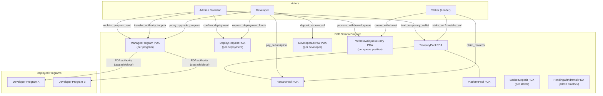
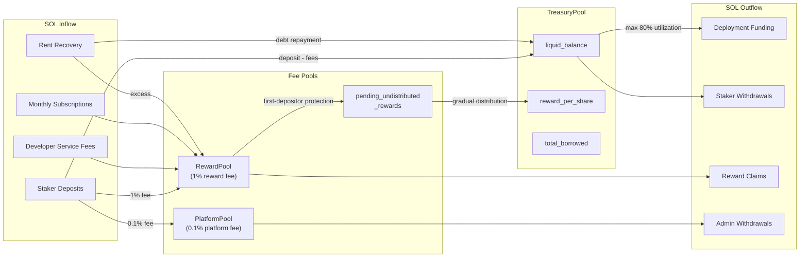
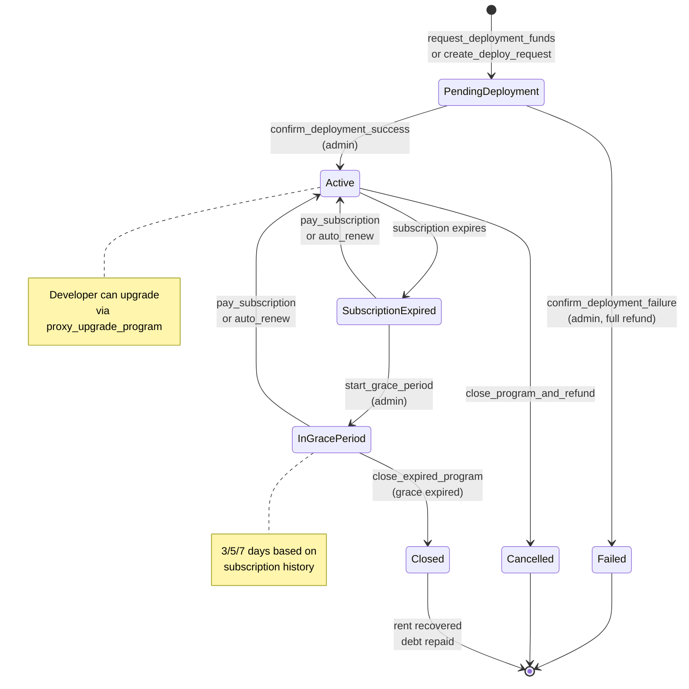
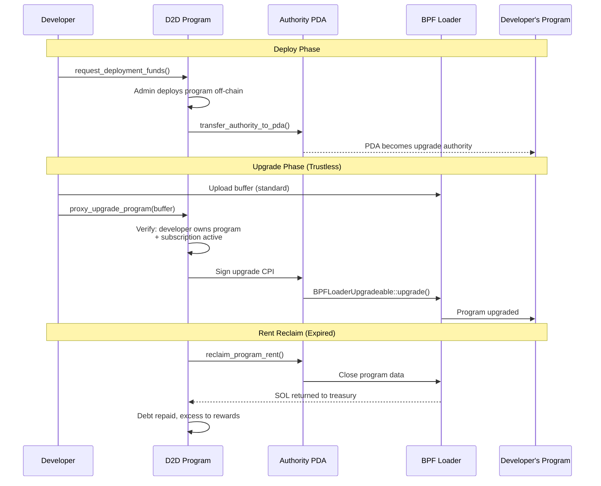
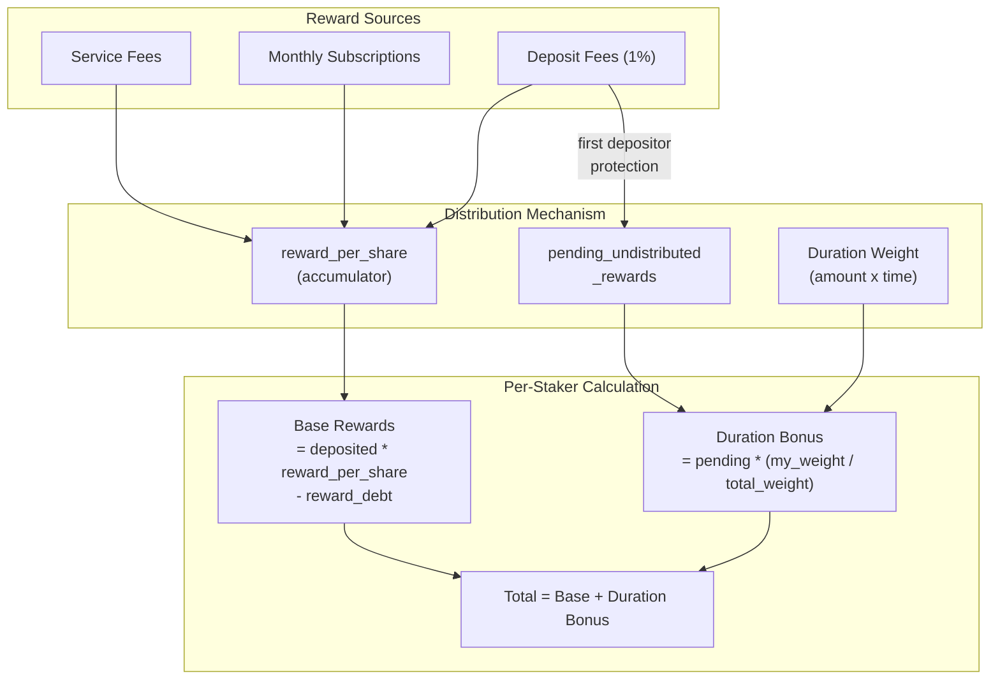
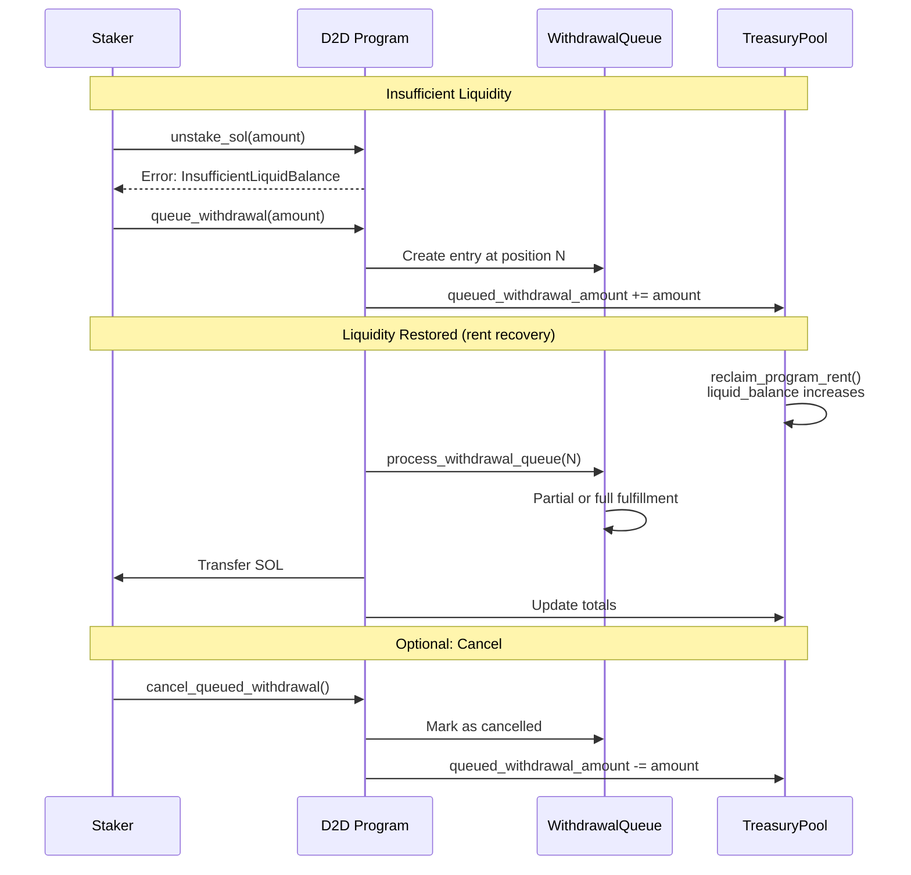
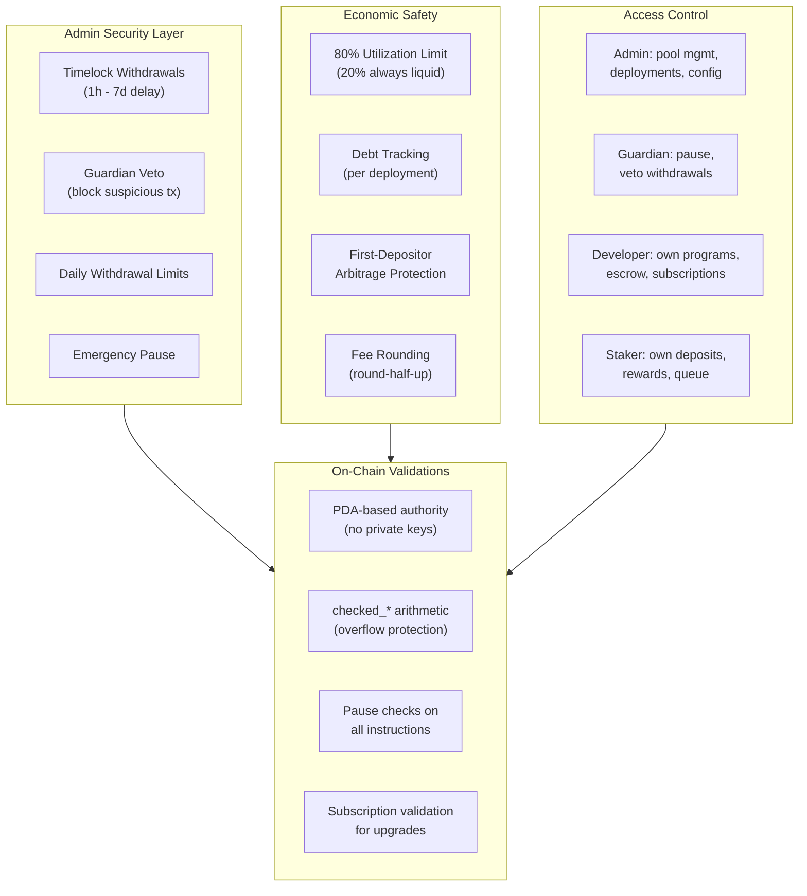

# D2D Protocol - Solana Program

A decentralized deployment platform enabling developers to deploy Solana programs on mainnet at minimal cost through a staking/lending treasury model. D2D Protocol connects stakers (lenders), developers, and platform admin in a sustainable on-chain economic system.

**Program ID:** `HDxYgZcTu6snVtCEozCUkhwmmUngWEsYuNKJsvgpyL5k`

## Architecture Overview



## Economic Model



## Deployment Lifecycle



## PDA Authority Model



## Staker Reward System



## Withdrawal Queue



## Security Architecture



## State Accounts

| Account | PDA Seeds | Purpose |
|---------|-----------|---------|
| **TreasuryPool** | `["treasury_pool"]` | Central pool: deposits, rewards, debt tracking, withdrawal queue, dynamic APY |
| **BackerDeposit** | `["lender_stake", staker]` | Per-staker: deposited amount, reward debt, duration weight, queued withdrawal |
| **DeployRequest** | `["deploy_request", ...]` | Per-deployment: status, fees, subscription, grace period, debt tracking |
| **ManagedProgram** | `["managed_program", program_id]` | Per-program: developer, authority PDA, upgrade count |
| **DeveloperEscrow** | `["developer_escrow", developer]` | Per-developer: SOL/USDC/USDT balances for auto-renewal |
| **WithdrawalQueueEntry** | `["withdrawal_queue", position]` | Per-queue-entry: staker, amount, partial fulfillment tracking |
| **PendingWithdrawal** | `["pending_withdrawal", ...]` | Admin timelock: amount, destination, execute_after, vetoed |
| **UserDeployStats** | `["user_stats", user]` | Per-user: deployment count, rate limiting |

### Sub-PDAs (Token Pools)

| PDA | Seeds | Purpose |
|-----|-------|---------|
| **RewardPool** | `["reward_pool"]` | Holds SOL for staker rewards |
| **PlatformPool** | `["platform_pool"]` | Holds SOL for platform revenue |
| **Authority PDA** | `["program_authority", program_id]` | Upgrade authority for managed programs |

## Instructions

### Initialization
| Instruction | Signer | Description |
|-------------|--------|-------------|
| `initialize` | Admin | Initialize treasury pool with APY and dev wallet |
| `reinitialize_treasury_pool` | Admin | Reinitialize with new parameters |
| `migrate_treasury_pool` | Admin | Migrate state for schema upgrades |

### Staker (Lender) Operations
| Instruction | Signer | Description |
|-------------|--------|-------------|
| `stake_sol` | Staker | Deposit SOL into treasury (1% reward fee + 0.1% platform fee) |
| `unstake_sol` | Staker | Withdraw SOL (if liquid balance sufficient) |
| `emergency_unstake` | Staker | Emergency withdrawal with reward settlement |
| `claim_rewards` | Staker | Claim base rewards + duration bonus |
| `queue_withdrawal` | Staker | Queue withdrawal when liquidity insufficient |
| `cancel_queued_withdrawal` | Staker | Cancel a queued withdrawal |

### Developer Operations
| Instruction | Signer | Description |
|-------------|--------|-------------|
| `request_deployment_funds` | Developer | Request deployment with service fee + subscription |
| `pay_subscription` | Developer | Pay monthly subscription (extends validity) |
| `proxy_upgrade_program` | Developer | Upgrade program via PDA proxy (trustless) |
| `initialize_escrow` | Developer | Create escrow account for auto-renewal |
| `deposit_escrow_sol` | Developer | Deposit SOL into escrow |
| `withdraw_escrow_sol` | Developer | Withdraw SOL from escrow |
| `toggle_auto_renew` | Developer | Enable/disable auto-renewal |
| `set_preferred_token` | Developer | Set preferred token (SOL/USDC/USDT) |

### Admin Operations
| Instruction | Signer | Description |
|-------------|--------|-------------|
| `create_deploy_request` | Admin | Create deployment request on behalf of developer |
| `fund_temporary_wallet` | Admin | Fund temp wallet for deployment (records debt) |
| `confirm_deployment` | Admin | Confirm deployment success/failure |
| `transfer_authority_to_pda` | Admin | Transfer program authority to D2D PDA |
| `reclaim_program_rent` | Admin | Reclaim rent from expired programs (repays debt) |
| `close_program_and_refund` | Admin | Close program and refund developer |
| `process_withdrawal_queue` | Admin | Fulfill queued withdrawals when liquidity available |
| `distribute_pending_rewards` | Admin | Gradually distribute pending rewards to stakers |
| `auto_renew_subscription` | Admin | Trigger auto-renewal from developer escrow |
| `start_grace_period` | Admin | Start grace period for expired subscription |
| `close_expired_program` | Admin | Close program after grace period expires |
| `force_rebalance` | Admin | Sync treasury balances |
| `sync_liquid_balance` | Admin | Sync liquid_balance with actual lamports |
| `force_reset_deployment` | Admin | Force reset a stuck deployment |
| `credit_fee_to_pool` | Admin | Credit fees to reward/platform pools |
| `emergency_pause` | Admin | Toggle emergency pause |

### Security Operations
| Instruction | Signer | Description |
|-------------|--------|-------------|
| `set_guardian` | Admin | Set guardian address |
| `set_timelock_duration` | Admin | Set timelock duration (1h-7d) |
| `set_daily_limit` | Admin | Set daily withdrawal limit |
| `initiate_withdrawal` | Admin | Initiate timelocked withdrawal |
| `execute_withdrawal` | Admin | Execute after timelock expires |
| `cancel_withdrawal` | Admin | Cancel pending withdrawal |
| `guardian_pause` | Guardian | Emergency pause by guardian |
| `guardian_veto` | Guardian | Veto a pending withdrawal |

## Key Constants

| Constant | Value | Description |
|----------|-------|-------------|
| `REWARD_FEE_BPS` | 100 (1%) | Fee on deposits directed to reward pool |
| `PLATFORM_FEE_BPS` | 10 (0.1%) | Fee on deposits directed to platform pool |
| `PRECISION` | 1e12 | Reward-per-share precision multiplier |
| `MAX_UTILIZATION_BPS` | 8000 (80%) | Max pool utilization for deployments |
| `DEFAULT_BASE_APY_BPS` | 500 (5%) | Default base APY |
| `DEFAULT_MAX_APY_MULTIPLIER` | 30000 (3x) | Max APY multiplier at high utilization |
| `DEFAULT_TARGET_UTILIZATION` | 6000 (60%) | Target utilization for APY curve |
| `DEFAULT_TIMELOCK` | 86400s (24h) | Default admin withdrawal timelock |
| `MAX_EXTENSION_MONTHS` | 120 (10y) | Maximum subscription extension |

## Project Structure

```
programs/d2d-program-sol/src/
├── lib.rs                              # Program entry point, instruction dispatch
├── errors.rs                           # Error codes (40+ categorized errors)
├── events.rs                           # On-chain events (30+ event types)
├── states/
│   ├── treasury_pool.rs                # Central treasury with debt, queue, APY
│   ├── lender_stake.rs                 # Per-staker deposit & reward tracking
│   ├── deploy_request.rs              # Deployment lifecycle & subscription
│   ├── managed_program.rs             # PDA authority proxy for programs
│   ├── developer_escrow.rs            # Auto-renewal escrow (SOL/USDC/USDT)
│   ├── withdrawal_queue.rs            # Staker withdrawal queue entries
│   ├── pending_withdrawal.rs          # Admin timelocked withdrawals
│   └── user_deploy_stats.rs           # User deployment statistics
├── instructions/
│   ├── initialize.rs                   # Treasury initialization
│   ├── request_deployment_funds.rs    # Developer deployment request
│   ├── lender/
│   │   ├── stake_sol.rs               # Stake with first-depositor protection
│   │   ├── unstake_sol.rs             # Unstake with queue check
│   │   ├── claim_rewards.rs           # Claim base + duration bonus
│   │   ├── emergency_unstake.rs       # Emergency withdrawal
│   │   ├── queue_withdrawal.rs        # Queue when illiquid
│   │   └── cancel_queued_withdrawal.rs
│   ├── developer/
│   │   ├── pay_subscription.rs        # Monthly subscription payment
│   │   ├── proxy_upgrade_program.rs   # Trustless upgrade via PDA
│   │   ├── initialize_escrow.rs       # Create escrow account
│   │   ├── deposit_escrow_sol.rs      # Fund escrow
│   │   ├── withdraw_escrow_sol.rs     # Withdraw from escrow
│   │   ├── toggle_auto_renew.rs       # Toggle auto-renewal
│   │   └── set_preferred_token.rs     # Set payment token preference
│   └── admin/
│       ├── fund_temporary_wallet.rs   # Fund deployment (debt tracking)
│       ├── confirm_deployment.rs      # Confirm success/failure
│       ├── transfer_authority_to_pda.rs # Transfer authority to PDA
│       ├── reclaim_program_rent.rs    # Reclaim rent (debt repayment)
│       ├── process_withdrawal_queue.rs # Fulfill queued withdrawals
│       ├── distribute_pending_rewards.rs # Gradual reward distribution
│       ├── auto_renew_subscription.rs # Trigger auto-renewal
│       ├── start_grace_period.rs      # Start grace period
│       ├── close_expired_program.rs   # Close after grace
│       ├── close_program_and_refund.rs
│       ├── create_deploy_request.rs
│       ├── credit_fee_to_pool.rs
│       ├── admin_withdraw.rs
│       ├── admin_withdraw_reward_pool.rs
│       ├── close_treasury_pool.rs
│       ├── reinitialize_treasury_pool.rs
│       ├── migrate_treasury_pool.rs
│       ├── sync_liquid_balance.rs
│       ├── force_rebalance.rs
│       ├── force_reset_deployment.rs
│       ├── emergency_pause.rs
│       ├── set_guardian.rs
│       ├── guardian_pause.rs
│       ├── set_timelock_duration.rs
│       ├── set_daily_limit.rs
│       ├── initiate_withdrawal.rs
│       ├── execute_withdrawal.rs
│       ├── cancel_withdrawal.rs
│       └── guardian_veto.rs
```

## Build & Deploy

```bash
# Prerequisites
# - Solana CLI v2.1+
# - Anchor v0.31.1+ (CLI v0.32.1)
# - Rust toolchain

# Build
anchor build

# Deploy to devnet
anchor deploy --provider.cluster devnet

# Run tests
anchor test
```

## License

MIT
